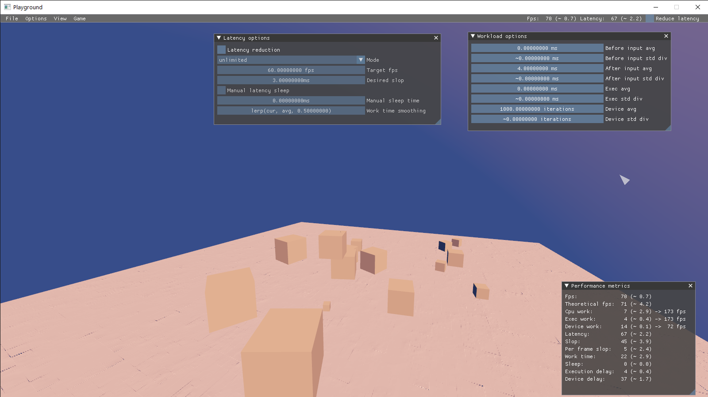
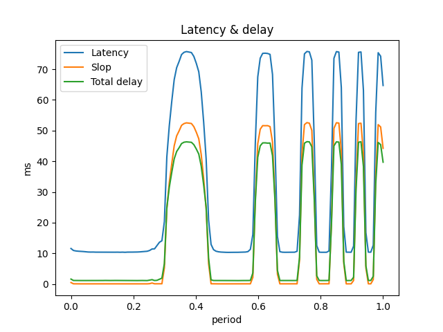
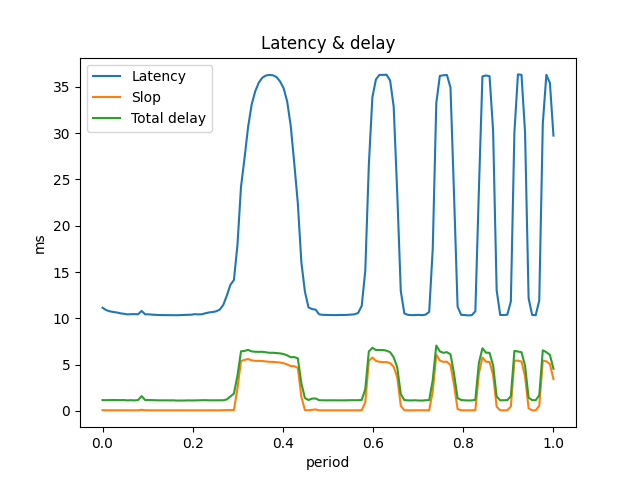
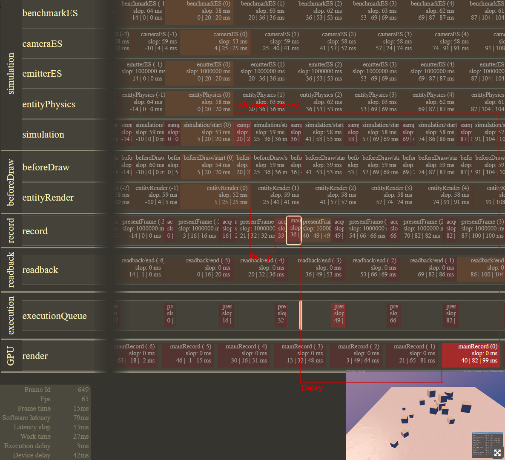
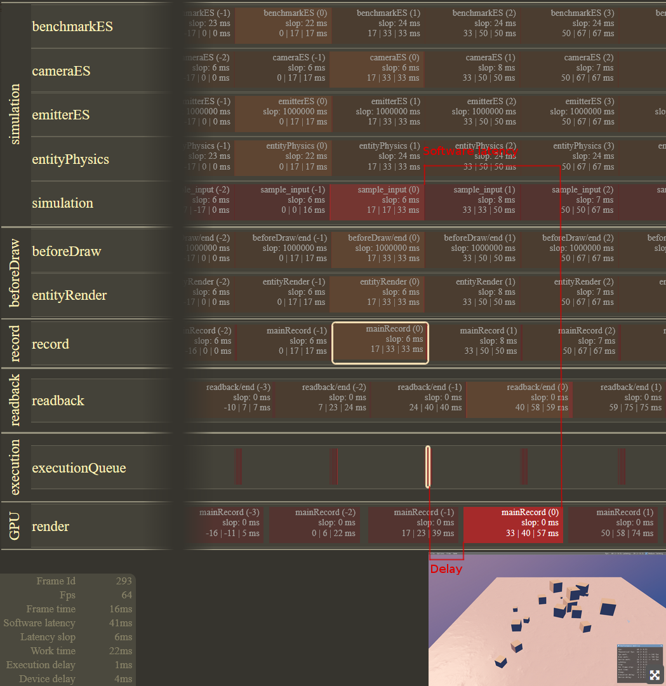

# Latency reduction

## Description

__This is a learning project, so please don't expect production ready implementations for any of its systems.__ The primary goal was to experiment with various technologies and learn from it.

This project implements a small gaming engine with very limited feature set, built on the Vulkan API. It features a custom approach to framegraphs, which incorporate the necessary tools that allow the usage of the latency reduction system

## Features

* Latency reduction system designed for framegraphs
* Simple framegraph implementation
* Basic vulkan-based engine implementation, with limited feature set
* Custom shader preprocessor, similarly with limited feature set
* Custom perf metrics tools
* A system for capturing frames with a visualizer
* Launch configurations for many different benchmarks

## Try it out

The provided configurations have artificial workload, which can be controlled under `Options` -> `Workload options`.

Latency reduction config can be configured under `Options` -> `Latency options`.

For simplicity use the provided demo configuration, downloaded from the releases or under `demo/` after a local build.

There are many launchers configured for different benchmarks under `launchers/`. Feel free to try any of them.

### Controls
* F10: Create a capture (check under `captures/` in the cwd of the application)
* F11: Toggle free camera
* WASDE + mouse during free camera mode: move around
* Shift: moving faster

## The thesis

[Read more here](documents/thesis.pdf)

### A few results

This repository contains a few captures that I have created for demonstration. These are html files generated by the application: `documents/captures/`

I have created several plots from the results of the benchmarks: `documents/benchmarks/*/`

#### Reference

#### Latency reduction with unlimited fps

#### Capture of a scene __without__ latency reduction

#### Capture of a scene __with__ latency reduction

